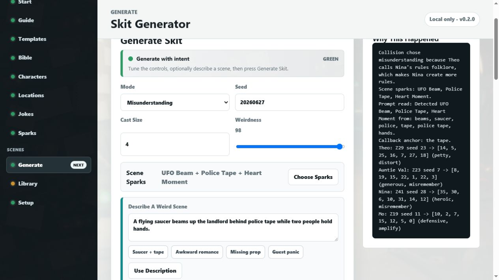
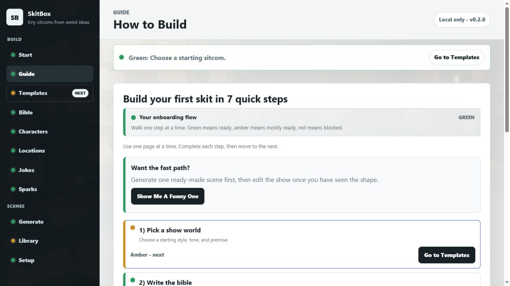
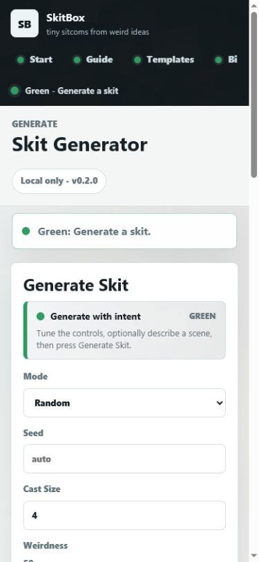

# SkitBox

**Tiny sitcoms from weird ideas. No API keys. No accounts. No cloud bill.**

SkitBox is a local-first Windows app for turning odd scene ideas into repeatable
little sitcom scripts. Give it a prompt like "a saucer beam, police tape, and a
heart above two people", press a button, and it builds a structured skit with
cast, setting, running joke, story beats, and a "why this happened" trace.



## Download And Run

1. Go to the [latest release](https://github.com/Martin123132/SkitBox/releases/latest).
2. Download `SkitBox-v0.2.0.zip`.
3. Unzip it somewhere easy to find.
4. Double-click `START_SkitBox_WINDOWS.bat`.
5. When the browser opens, press `Show Me A Funny One`.

SkitBox needs Python 3.10 or newer. It does not need npm, Ollama, OpenAI,
Claude, API keys, login, or an installer.

To stop it, close the server window or double-click `STOP_SkitBox_WINDOWS.bat`.

## What It Feels Like

SkitBox teaches through the app itself. The pages are split up, the side menu
uses red/amber/green readiness lights, and the generator always shows the next
useful step.



The default world is a shared-house sitcom setup, but the app includes editors
for the show bible, cast, locations, props, jokes, rules, relationships, and
scene sparks.

On a phone-sized browser, the same flow stays readable:



## What You Can Do

- Generate a skit from a seed, mode, cast size, and weirdness level.
- Type a strange scene description and let SkitBox turn it into scene sparks.
- Save favourite skits locally.
- Export TXT or HTML.
- Open the exports folder from the app.
- Reset back to the built-in starter show.

Everything is deterministic and local. The same seed and settings make the same
skit again.

## Where Data Goes

The Windows launcher prefers D-drive storage when available:

```text
D:\SkitBoxData
```

For development or portable runs, set `SKITBOX_HOME`:

```powershell
New-Item -ItemType Directory -Force -Path D:\Temp, D:\SkitBoxData | Out-Null
$env:TEMP = "D:\Temp"
$env:TMP = "D:\Temp"
$env:SKITBOX_HOME = "D:\SkitBoxData"
python -m sitcom_engine_app.app
```

SkitBox does not store runtime data in the Git-tracked app folders.

## Developer Checks

```powershell
New-Item -ItemType Directory -Force -Path D:\Temp, D:\SkitBoxData | Out-Null
$env:TEMP = "D:\Temp"
$env:TMP = "D:\Temp"
$env:SKITBOX_HOME = "D:\SkitBoxData"
python -m unittest discover -s tests
python -m compileall sitcom_engine_app tests scripts
python scripts\sample_episodes.py --count 5
python -m sitcom_engine_app.app --doctor
```

Build and verify a release ZIP:

```powershell
New-Item -ItemType Directory -Force -Path D:\Temp, D:\SkitBoxData, D:\SkitBoxVerifyWork | Out-Null
$env:TEMP = "D:\Temp"
$env:TMP = "D:\Temp"
$env:SKITBOX_HOME = "D:\SkitBoxData"
powershell -ExecutionPolicy Bypass -File scripts\make_release_zip.ps1
$zip = (Get-ChildItem dist\SkitBox-v*.zip | Sort-Object LastWriteTime -Descending | Select-Object -First 1).FullName
powershell -ExecutionPolicy Bypass -File scripts\verify_release_zip.ps1 -ZipPath $zip -WorkRoot D:\SkitBoxVerifyWork
```

## Feedback

If you try it, leave first-run feedback in
[Issue #1](https://github.com/Martin123132/SkitBox/issues/1). The most useful
notes are whether it opened, how long it took to get your first skit, and what
line made you laugh.

## License

SkitBox is source-available for personal and non-commercial use under the
PolyForm Noncommercial License 1.0.0. Commercial use requires a separate
written license from the licensor.
